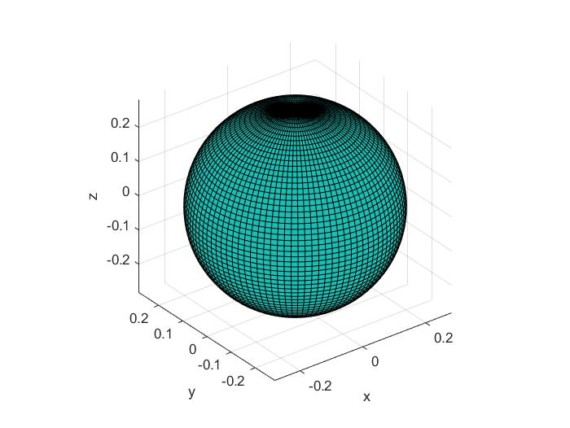

# Drawing-Electron-Cloud-with-Matlab

## English Version(中文版请下拉)

  In the memory of 2019 New Year, I stayed up and realize the codes in the Dissertation found in [CNKI](http://www.cnki.net) named "Drawing Angular Part of Atomic Orbital and Hybrid Orbital By Using MATLAB" by LV Shenzhuɑnɡ(School of Chemistry， Leshan Normal University， Leshan Sichuan 614000， China).

  But I found several mistakes in the Dissertation and I corrected them. You can see my corrections in the pdf document. They may be some publish mistakes.
    
  With my correction, I successfully Draw the Electron Cloud with Matlab according to the Dissertation.
  
  The project contains the corrected codes in the dissertation and pictures of 3D-Coordinates and Polar-Coordinates both in fig ang jpg.

  The main code is "Main.m" and the fuctions is the other .m files.
  
  I welcome the Chemistry teachers to apply the pictures in your class and it's also my pleasure.
  
  
  
  # 用Matlab画电子轨道
  
  ## 中文版
  
   现在是2019年元旦，新的一年，新的开始，我决定创建一个项目来给新的一年一个好的开始！:) 于是我准备实现吕申壮教授（乐山师范学院 化学学院，四川 乐山）《用 MATLAB 绘制原子轨道及杂化轨道角度部分图》中的代码！
   
   我在论文中发现了一些错误，但是我将他们进行了改正。你可以在我项目中附的pdf论文中找出我的改正。这些错误或是少字漏字，也有多字，可能是由于排版印刷错误引起的。
   
   最终，在我的改正下，我成功实现了用Matlab画电子轨道！
   
   这个项目包含了论文中的源代码实现，和分别以fig与jpg格式保存的在三维坐标系和极坐标系下的绘图。

   主程序在Main.m中，函数在其它.m文件中。
   
   欢迎所有化学老师在教学工作中应用我的图片以及代码。
